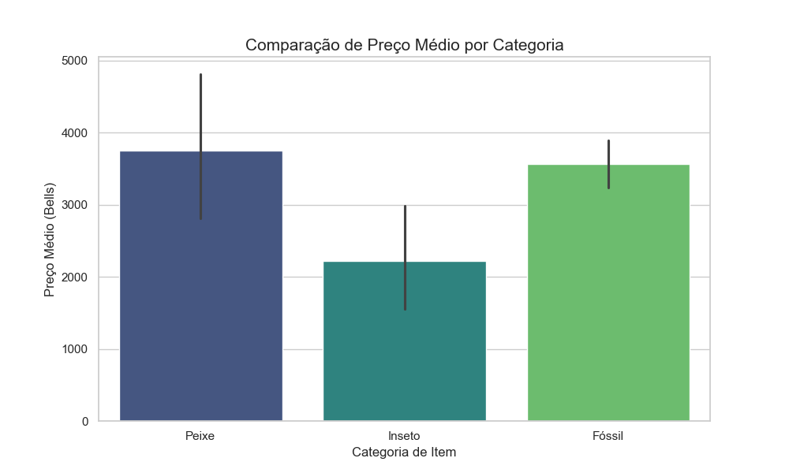

## Animal Crossing: Data Economy Analysis

Este projeto realiza uma análise exploratória dos itens do jogo Animal Crossing: New Horizons, utilizando Python e Pandas para identificar os itens mais valiosos e comparar a economia entre diferentes categorias.

## Principais Insights encontrados:
- **O item mais valioso:** `barreleye` (Peixe), custando 15.000 Bells.
- **Categoria mais lucrativa:** Peixes possuem a maior média de valor de venda (~3.745 Bells), superando Fósseis e Insetos.
- **Mercado Musical:** As músicas à venda possuem um preço tabelado de 3.200 Bells (após a filtragem de itens não comercializáveis).

## Tecnologias Utilizadas
- **Python** (Lógica principal)
- **Pandas** (Tratamento e limpeza de dados)
- **Seaborn/Matplotlib** (Visualização de dados)
- **Glob/OS** (Automação de leitura de múltiplos arquivos)

## Visualização

---
*Projeto desenvolvido para fins de estudo de análise de dados.*